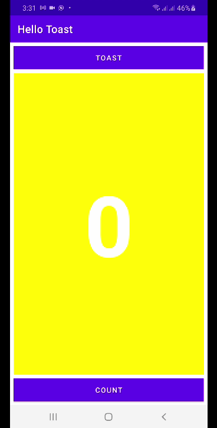

# Hello Toast
## Two Acitivies

### Question 1
What changes are made when you add a second Activity to your app by choosing File > New > Activity and an Activity template? Choose one:<br//>
The second Activity is added as a Java class. You still need to add the XML layout file. 
The second Activity XML layout file is created and a Java class added. You still need to define the class signature. 
The second Activity is added as a Java class, the XML layout file is created, and the AndroidManifest.xml file is changed to declare a second Activity. 
The second Activity XML layout file is created, and the AndroidManifest.xml file is changed to declare a second Activity. 
<b>Answer: </b>The second Activity is added as a Java class, the XML layout file is created, and the AndroidManifest.xml file is changed to declare a second Activity. 
### Question 2
What happens if you remove the android:parentActivityName and the <meta-data> elements from the second Activity declaration in the AndroidManifest.xml file? Choose one: 
The second Activity no longer appears when you try to start it with an explicit Intent. 
The second Activity XML layout file is deleted. 
The Back button no longer works in the second Activity to send the user back to the main Activity. 
The Up button in the app bar no longer appears in the second Activity to send the user back to the parent Activity. 
<b>Answer: </b>The Up button in the app bar no longer appears in the second Activity to send the user back to the parent Activity 
### Question 3
Which constructor method do you use to create a new explicit Intent? Choose one: 
new Intent() 
new Intent(Context context, Class<?> class) 
new Intent(String action, Uri uri) 
new Intent(String action) 
<b>Answer: </b>new Intent(Context context, Class<?> class) 
### Question 4
In the HelloToast app homework, how do you add the current value of the count to the Intent? Choose one: 
As the Intent data 
As the Intent TEXT_REQUEST 
As an Intent action 
As an Intent extra 
<b>Answer: </b>As an Intent extra 
### Question 5
In the HelloToast app homework, how do you display the current count in the second "Hello" Activity? Choose one: 
Get the Intent that the Activity was launched with. 
Get the current count value out of the Intent. 
Update the TextView for the count. 
All of the above. 
<b>Answer: </b>All of the above. 
